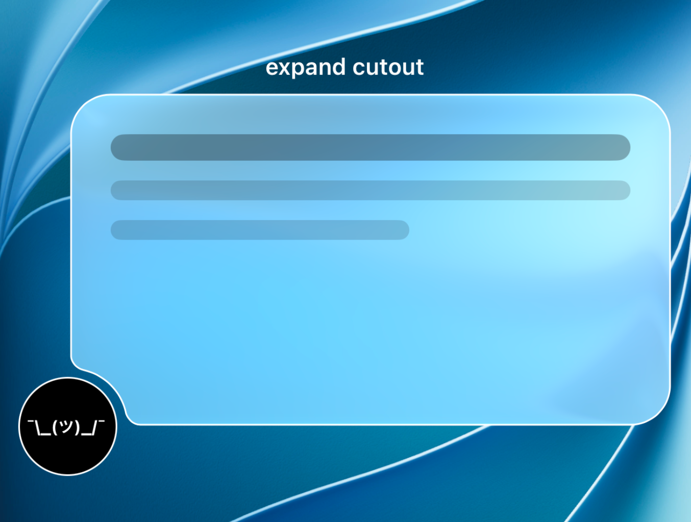

# TiCutoutView

<p align="center">
  <picture>
    <source media="(prefers-color-scheme: dark)" srcset="assets/TiCutoutView-Screenshot-Dark.png">
    <source media="(prefers-color-scheme: light)" srcset="assets/TiCutoutView-Screenshot-Light.png">
    
  </picture>
</p>

`ti.cutoutview` is a UIKit-backed Titanium iOS container whose fill, border, drop shadow, content mask, and visual-effect material all follow one configurable shape. Version `0.3.0` supports circular and rectangular concave cutouts at every corner or edge, native path animation, blur, and iOS 26 Liquid Glass.

## Requirements

- Titanium SDK 13.3.0.GA or newer
- iOS 26.0 or newer
- Module built with Titanium SDK 13.4.1.GA

## Basic usage

```js
const CutoutView = require('ti.cutoutview');

const panel = CutoutView.createView({
	cutoutPlacement: CutoutView.PLACEMENT_BOTTOM_LEFT,
	cutoutShape: CutoutView.SHAPE_CIRCLE,
	cutoutRadius: 54,
	cutoutCenterOffset: { x: 0, y: 0 },
	cutoutSmoothing: 12,

	material: CutoutView.MATERIAL_GLASS,
	glassStyle: CutoutView.GLASS_STYLE_REGULAR,
	glassTintColor: '#30FFFFFF',
	glassInteractive: true,

	cornerRadius: 24,
	borderColor: '#80FFFFFF',
	borderWidth: 1,
	shadowColor: '#000000',
	shadowOpacity: 0.18,
	shadowRadius: 12,
	shadowOffset: { x: 0, y: 5 },
	clipContentToShape: true,
	shapeAwareHitTesting: true
});

panel.add(Ti.UI.createLabel({ text: 'Profile information' }));
```

Place a `100 × 100` circular profile view beside the panel with a higher `zIndex`. A `cutoutRadius` of `54` leaves four points of clearance around a profile image whose `borderRadius` is `50`.

## Cutout shapes

The default circular shape continues to use `cutoutRadius`:

```js
cutoutShape: CutoutView.SHAPE_CIRCLE,
cutoutRadius: 54
```

Rectangles use `cutoutSize` and `cutoutCornerRadius`:

```js
cutoutShape: CutoutView.SHAPE_RECTANGLE,
cutoutSize: { width: 112, height: 84 },
cutoutCornerRadius: 18
```

Pass a number to `cutoutSize` for a square:

```js
cutoutShape: CutoutView.SHAPE_RECTANGLE,
cutoutSize: 100,
cutoutCornerRadius: 0
```

The size describes the complete profile shape centered on the selected edge or corner. Consequently, half of its depth intersects an edge by default, while one quarter intersects a corner. Use `cutoutCenterOffset` to move the shape farther into or out of the panel. The string `square` is accepted as an alias for `rectangle`.

## Cutout placement

Use one of these constants:

```js
CutoutView.PLACEMENT_TOP_LEFT
CutoutView.PLACEMENT_TOP
CutoutView.PLACEMENT_TOP_RIGHT
CutoutView.PLACEMENT_RIGHT
CutoutView.PLACEMENT_BOTTOM_RIGHT
CutoutView.PLACEMENT_BOTTOM
CutoutView.PLACEMENT_BOTTOM_LEFT
CutoutView.PLACEMENT_LEFT
```

`cutoutAlignment` positions an edge cutout along its edge. It ranges from `0` at the leading end to `1` at the trailing end and defaults to `0.5`. The value is constrained as needed so the cutout and its smoothing shoulders fit between the outer corners.

`cutoutCorner` and `CORNER_BOTTOM_LEFT` remain available as `0.1.0` compatibility aliases.

## Materials

```js
// Native blur
panel.material = CutoutView.MATERIAL_BLUR;
panel.blurStyle = Ti.UI.iOS.BLUR_EFFECT_STYLE_SYSTEM_MATERIAL;

// iOS 26 Liquid Glass
panel.material = CutoutView.MATERIAL_GLASS;
panel.glassStyle = CutoutView.GLASS_STYLE_CLEAR;
panel.glassTintColor = '#267C4DFF';
panel.glassInteractive = true;

// Opaque or translucent color fill
panel.material = CutoutView.MATERIAL_SOLID;
panel.fillColor = '#FFFFFF';
```

The custom shape masks the complete `UIVisualEffectView`, so blur or glass follows both the rounded outer corners and the concave cutout. `fillColor` applies to the solid material; it does not paint over blur or glass.

## Native animation

```js
panel.addEventListener('cutoutanimationcomplete', event => {
	Ti.API.info(`Finished: ${event.finished}`);
});

panel.animateCutout({
	cutoutPlacement: CutoutView.PLACEMENT_BOTTOM,
	cutoutShape: CutoutView.SHAPE_RECTANGLE,
	cutoutSize: { width: 112, height: 84 },
	cutoutCornerRadius: 18,
	cutoutAlignment: 0.72,
	cutoutCenterOffset: { x: 0, y: 0 },
	cutoutSmoothing: 14,
	duration: 700,
	timing: 'spring',
	dampingRatio: 0.78,
	initialVelocity: 0.2,
	respectReducedMotion: true
});
```

`duration` and `delay` are milliseconds. Supported timing values are `linear`, `easeIn`, `easeOut`, `easeInOut`, and `spring`. Geometry interpolates directly when the placement and shape are unchanged. A placement or shape change closes the current cutout before opening the new one, avoiding an invalid path morph between unrelated outlines.

Starting another animation or directly changing an animated geometry property cancels the active animation. The completion event then reports `finished: false`. The module emits:

- `cutoutanimationstart`, with the requested `options`
- `cutoutanimationcomplete`, with `finished` and the resulting cutout geometry

## Properties

| Property | Type | Default | Description |
| --- | --- | --- | --- |
| `cutoutPlacement` | String | `bottomLeft` | Any placement constant listed above. |
| `cutoutCorner` | String | `bottomLeft` | Backward-compatible alias for `cutoutPlacement`. |
| `cutoutShape` | String | `circle` | `SHAPE_CIRCLE` or `SHAPE_RECTANGLE`. The string `square` aliases `rectangle`. |
| `cutoutRadius` | Number | `54` | Radius of a circular cutout in points. Ignored by rectangular cutouts. |
| `cutoutSize` | Number or Object | `{ width: 108, height: 108 }` | Complete rectangular cutout size. A number creates a square. |
| `cutoutCornerRadius` | Number | `0` | Rounds the inner corners of a rectangular cutout independently from the panel corners. |
| `cutoutCenterOffset` | Object | `{ x: 0, y: 0 }` | Additional `{ x, y }` offset from the selected corner or aligned edge position. |
| `cutoutSmoothing` | Number | `12` | Length of the shoulder transition between the panel edge and cutout boundary. |
| `cutoutAlignment` | Number | `0.5` | Edge position from `0` to `1`; ignored by corner placements. |
| `material` | String | `solid` | `MATERIAL_SOLID`, `MATERIAL_BLUR`, or `MATERIAL_GLASS`. The string `liquidGlass` is also accepted. |
| `fillColor` | String | `#FFFFFF` | Fill used by the solid material. |
| `blurStyle` | Number | system material | A `Ti.UI.iOS.BLUR_EFFECT_STYLE_*` value. |
| `glassStyle` | String | `regular` | `GLASS_STYLE_REGULAR` or `GLASS_STYLE_CLEAR`. |
| `glassTintColor` | String | none | Optional Liquid Glass tint color. |
| `glassInteractive` | Boolean | `false` | Enables UIKit's native interactive Liquid Glass response while preserving Titanium touch and `click` delivery. |
| `cornerRadius` | Number or Object | `0` | One radius or `{ topLeft, topRight, bottomRight, bottomLeft }`. |
| `borderColor` | String | transparent | Border color following the complete custom outline. |
| `borderWidth` | Number | `0` | Border width in points. |
| `shadowColor` | String | `#000000` | Shape-aware shadow color. |
| `shadowOpacity` | Number | `0` | Shadow opacity from `0` to `1`. |
| `shadowRadius` | Number | `0` | Shadow blur radius. |
| `shadowOffset` | Object | `{ x: 0, y: 0 }` | Shape shadow offset. |
| `clipContentToShape` | Boolean | `true` | Clips Titanium children to the custom path. |
| `shapeAwareHitTesting` | Boolean | `true` | Rejects touches in the transparent cutout. |

## Build

```sh
DEVELOPER_DIR=/Applications/Xcode-RC.app/Contents/Developer \
ti build -p ios --build-only --project-dir ios \
  --sdk 13.4.1.GA --no-prompt --no-banner
```

The packaged module is written to `ios/dist/ti.cutoutview-iphone-0.3.0.zip`.

## License

MIT
